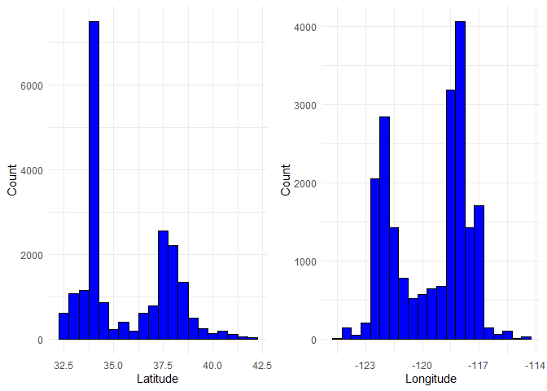
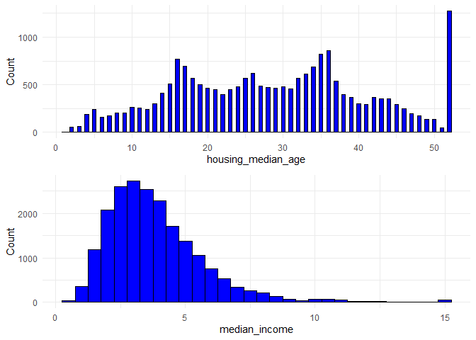
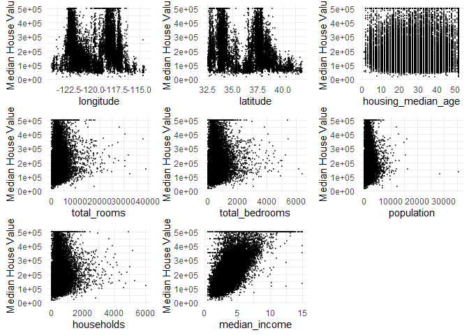
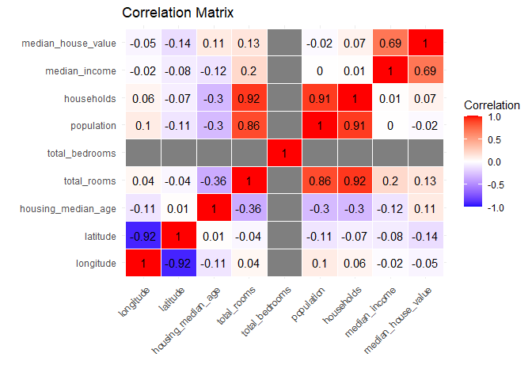
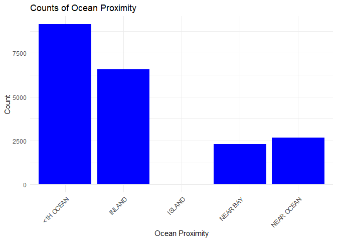

California Housing Prices Prediction - Data Visualization
================
Balaji Bharadwaj

## Introduction

The housing market is a complex and ever-changing system. There are many
factors that can affect the price of a home, including location, size,
condition, and amenities.

In recent years, machine learning algorithms have been increasingly used
to predict housing prices. Machine learning algorithms are trained on
large datasets of historical data, and they use this data to learn
patterns and relationships.

For this project, I will be using the dataset of housing prices from the
San Francisco Bay Area in order to build the models. Firstly, I will be
examining and visualizing the dataset to many observations regarding the
same.

``` r
## Loading the required libraries
library(ggplot2)
library(gridExtra)
```

    ## Warning: package 'gridExtra' was built under R version 4.3.2

``` r
library(dplyr)
```

    ## 
    ## Attaching package: 'dplyr'

    ## The following object is masked from 'package:gridExtra':
    ## 
    ##     combine

    ## The following objects are masked from 'package:stats':
    ## 
    ##     filter, lag

    ## The following objects are masked from 'package:base':
    ## 
    ##     intersect, setdiff, setequal, union

``` r
library(reshape2)
```

    ## Warning: package 'reshape2' was built under R version 4.3.2

``` r
## Loading the dataset
housing <- read.csv("C:/Users/Balaji Bharadwaj/Downloads/UB Subjects/Predictive Analytics/Project/housing.csv")
head(housing)
```

    ##   longitude latitude housing_median_age total_rooms total_bedrooms population
    ## 1   -122.23    37.88                 41         880            129        322
    ## 2   -122.22    37.86                 21        7099           1106       2401
    ## 3   -122.24    37.85                 52        1467            190        496
    ## 4   -122.25    37.85                 52        1274            235        558
    ## 5   -122.25    37.85                 52        1627            280        565
    ## 6   -122.25    37.85                 52         919            213        413
    ##   households median_income median_house_value ocean_proximity
    ## 1        126        8.3252             452600        NEAR BAY
    ## 2       1138        8.3014             358500        NEAR BAY
    ## 3        177        7.2574             352100        NEAR BAY
    ## 4        219        5.6431             341300        NEAR BAY
    ## 5        259        3.8462             342200        NEAR BAY
    ## 6        193        4.0368             269700        NEAR BAY

We can see that there are 9 continuous variables and one categorical
variable (Ocean Proximity). Let us look at different charts and graphs
to make observations of the dataset.

## Data Visualization

Let us first look at the counts of the variables, latitude and
longitude.

``` r
continuous_vars <- c('longitude', 'latitude')
housing_cont <- housing %>% select(all_of(continuous_vars))

plot1 <- ggplot(housing_cont, aes(x = latitude)) +
  geom_histogram(binwidth = 0.5, fill = 'blue', color = 'black') +
  xlab('Latitude') +
  ylab('Count') +
  theme_minimal()

plot2 <- ggplot(housing_cont, aes(x = longitude)) +
  geom_histogram(binwidth = 0.5, fill = 'blue', color = 'black') +
  xlab('Longitude') +
  ylab('Count') +
  theme_minimal()

grid.arrange(plot1, plot2, nrow = 1, ncol = 2, widths = c(3, 3))
```

<!-- -->

We can see that a majority of the latitude entries lie at 34 degrees and
at 37 degrees; and a majority of the longitude entries lie at -118 and
-122 degrees. These regions correspond to Los angeles and the San
francisco bay area respectively.

Now let us look at the counts of the variables, Housing median age and
Median Income.

``` r
continuous_vars <- c('housing_median_age', 'median_income')
housing_cont <- housing %>% select(all_of(continuous_vars))

plot1 <- ggplot(housing_cont, aes(x = housing_median_age)) +
  geom_histogram(binwidth = 0.5, fill = 'blue', color = 'black') +
  xlab('housing_median_age') +
  ylab('Count') +
  theme_minimal()

plot2 <- ggplot(housing_cont, aes(x = median_income)) +
  geom_histogram(binwidth = 0.5, fill = 'blue', color = 'black') +
  xlab('median_income') +
  ylab('Count') +
  theme_minimal()

grid.arrange(plot1, plot2, nrow = 2, ncol = 1)
```

<!-- -->

We can see a majority of housing is of age greater than 50 years. A
majority of median income of families lie in the 200,000 - 400,000
range.

I will now generate scatter plots to see how each variable varies when
compared to our target variable, median housing value.

``` r
target <- housing$median_house_value


plots <- list()

for (i in seq_along(names(housing))) {
  col <- names(housing)[i]
  if (col != "median_house_value" && col != "ocean_proximity") {
    p <- ggplot(housing, aes_string(x = col, y = "median_house_value")) +
      geom_point(alpha = 0.5, size = 0.5) +
      xlab(col) +
      ylab("Median House Value") +
      theme_minimal()
    plots[[length(plots) + 1]] <- p
  }
}
```

    ## Warning: `aes_string()` was deprecated in ggplot2 3.0.0.
    ## ℹ Please use tidy evaluation idioms with `aes()`.
    ## ℹ See also `vignette("ggplot2-in-packages")` for more information.
    ## This warning is displayed once every 8 hours.
    ## Call `lifecycle::last_lifecycle_warnings()` to see where this warning was
    ## generated.

``` r
grid.arrange(grobs = plots, nrow = 3, ncol = 3)
```

    ## Warning: Removed 207 rows containing missing values (`geom_point()`).

<!-- -->

One of the main conclusions which we can draw from these scatterplots is
that as median income increases, the median housing value also
increases.

This can also be observed in the following heatmap.

``` r
numeric_housing <- housing[, sapply(housing, is.numeric)]
corr_matrix <- cor(numeric_housing)

# Melt the correlation matrix for visualization
melted_corr <- melt(corr_matrix)

# Create the heatmap
heatmap <- ggplot(melted_corr, aes(Var2, Var1, fill = value)) +
  geom_tile(color = "white") +
  scale_fill_gradient2(low = "blue", mid = "white", high = "red", 
                       midpoint = 0, limit = c(-1, 1), space = "Lab",
                       name="Correlation") +
  theme_minimal() +
  theme(axis.text.x = element_text(angle = 45, hjust = 1)) +  # Rotate x-axis labels
  labs(title = "Correlation Matrix", x = "", y = "") +  # Remove axis labels
  geom_text(aes(label = round(value, 2)), color = "black")  # Add annotations

# Display the plot
print(heatmap)
```

    ## Warning: Removed 16 rows containing missing values (`geom_text()`).

<!-- -->

Apart from the obvious observations that:

1.  population is correlated to the total rooms and households living in
    the block

2.  number of households being correlated to the total rooms

we can see a strong correlation (0.69) between median income and medium
housing value.

Let us now look at the categorical variable, Ocean_Promixity

``` r
ocean_proximity_counts <- table(housing$ocean_proximity)

ocean_proximity_counts_df <- data.frame(Category = names(ocean_proximity_counts),
                                        Count = as.numeric(ocean_proximity_counts))

bar_plot <- ggplot(ocean_proximity_counts_df, aes(x = Category, y = Count)) +
  geom_bar(stat = "identity", fill = "blue") +
  labs(title = "Counts of Ocean Proximity", x = "Ocean Proximity", y = "Count") +
  theme_minimal() +
  theme(axis.text.x = element_text(angle = 45, hjust = 1))


print(bar_plot)
```

<!-- -->

We can see that a majority of houses are located less than 1 hour from
the ocean followed by houses which are inland. Houses that are present
on a island make up a negligible amount of entries in the dataset.
