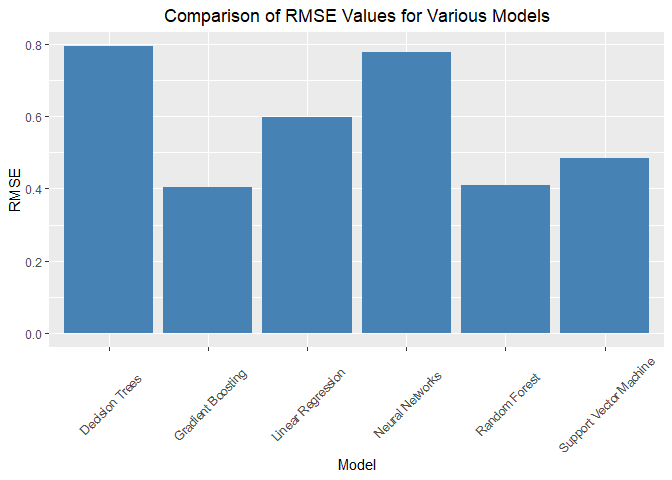

California Housing Prices Prediction - Machine Learning models
================
Balaji Bharadwaj

## Model building

Now that we have a good idea of what the dataset represents, let us
begin building the machine learning models for the dataset.

Firstly, I will convert the categorical variable ‘ocean_proximity’ to a
factor variable.

``` r
# Loading the required libraries
library(caret)
```

    ## Warning: package 'caret' was built under R version 4.3.2

    ## Loading required package: ggplot2

    ## Loading required package: lattice

``` r
library(forecast)
```

    ## Warning: package 'forecast' was built under R version 4.3.3

    ## Registered S3 method overwritten by 'quantmod':
    ##   method            from
    ##   as.zoo.data.frame zoo

``` r
# Loading the dataset
housing <- read.csv("C:/Users/Balaji Bharadwaj/Downloads/UB Subjects/Predictive Analytics/Project/housing.csv")

# Converting the ocean_proximity to factor variable
housing$ocean_proximity <- factor(housing$ocean_proximity)

# Converting the factor variable to numerical using as.numeric() function
housing$ocean_proximity <- as.numeric(housing$ocean_proximity)

# Displaying the columns and its values
str(housing)
```

    ## 'data.frame':    20640 obs. of  10 variables:
    ##  $ longitude         : num  -122 -122 -122 -122 -122 ...
    ##  $ latitude          : num  37.9 37.9 37.9 37.9 37.9 ...
    ##  $ housing_median_age: num  41 21 52 52 52 52 52 52 42 52 ...
    ##  $ total_rooms       : num  880 7099 1467 1274 1627 ...
    ##  $ total_bedrooms    : num  129 1106 190 235 280 ...
    ##  $ population        : num  322 2401 496 558 565 ...
    ##  $ households        : num  126 1138 177 219 259 ...
    ##  $ median_income     : num  8.33 8.3 7.26 5.64 3.85 ...
    ##  $ median_house_value: num  452600 358500 352100 341300 342200 ...
    ##  $ ocean_proximity   : num  4 4 4 4 4 4 4 4 4 4 ...

Now I will normalize the dataset, as there are a wide range of values in
different columns of the data.

``` r
# Normalizing the data
housing_norm <- as.data.frame(scale(housing[,]))

summary(housing_norm)
```

    ##    longitude          latitude       housing_median_age  total_rooms     
    ##  Min.   :-2.3859   Min.   :-1.4475   Min.   :-2.19613   Min.   :-1.2073  
    ##  1st Qu.:-1.1132   1st Qu.:-0.7968   1st Qu.:-0.84537   1st Qu.:-0.5446  
    ##  Median : 0.5389   Median :-0.6423   Median : 0.02865   Median :-0.2332  
    ##  Mean   : 0.0000   Mean   : 0.0000   Mean   : 0.00000   Mean   : 0.0000  
    ##  3rd Qu.: 0.7785   3rd Qu.: 0.9729   3rd Qu.: 0.66429   3rd Qu.: 0.2348  
    ##  Max.   : 2.6252   Max.   : 2.9580   Max.   : 1.85614   Max.   :16.8152  
    ##                                                                          
    ##  total_bedrooms      population        households      median_income    
    ##  Min.   :-1.2741   Min.   :-1.2561   Min.   :-1.3040   Min.   :-1.7743  
    ##  1st Qu.:-0.5740   1st Qu.:-0.5638   1st Qu.:-0.5742   1st Qu.:-0.6881  
    ##  Median :-0.2441   Median :-0.2291   Median :-0.2368   Median :-0.1768  
    ##  Mean   : 0.0000   Mean   : 0.0000   Mean   : 0.0000   Mean   : 0.0000  
    ##  3rd Qu.: 0.2590   3rd Qu.: 0.2645   3rd Qu.: 0.2758   3rd Qu.: 0.4593  
    ##  Max.   :14.0184   Max.   :30.2496   Max.   :14.6012   Max.   : 5.8581  
    ##  NA's   :207                                                            
    ##  median_house_value ocean_proximity  
    ##  Min.   :-1.6626    Min.   :-0.8206  
    ##  1st Qu.:-0.7561    1st Qu.:-0.8206  
    ##  Median :-0.2353    Median :-0.1167  
    ##  Mean   : 0.0000    Mean   : 0.0000  
    ##  3rd Qu.: 0.5015    3rd Qu.:-0.1167  
    ##  Max.   : 2.5403    Max.   : 1.9950  
    ## 

Let us now divide the dataset into two parts, training data and test
data. The training data will be used to train the machine learning
models while the test data will be used to validate the outputs of the
models.

I will apply a split of 80:20 in favour for the training data.

``` r
# Partitioning the data into train set
set.seed(123)
train.rows <- sample(rownames(housing_norm), dim(housing_norm)[1]*0.8)
train.data <- housing_norm[train.rows, ]
dim(train.data)
```

    ## [1] 16512    10

``` r
train.data <- train.data[complete.cases(train.data), ]
dim(train.data)
```

    ## [1] 16349    10

``` r
# Using the remaining data as validation set
valid.rows <- setdiff(rownames(housing_norm), train.rows) 
valid.data <- housing_norm[valid.rows, ]
dim(valid.data)
```

    ## [1] 4128   10

``` r
valid.data <- valid.data[complete.cases(valid.data), ]
dim(valid.data)
```

    ## [1] 4084   10

#### Linear Regression model

``` r
lm.fit <- train(median_house_value ~ ., data = train.data, method = "lm")
lm.pred <- predict(lm.fit, newdata = valid.data)
accuracy(lm.pred, valid.data$median_house_value)
```

    ##                   ME     RMSE       MAE      MPE     MAPE
    ## Test set 0.002026927 0.596938 0.4388365 1.375003 209.2251

We get the following output:

ME - 0.002026927

RMSE - 0.596938

MAE - 0.4388365

MPE - 1.375003

MAPE - 209.2251

### Decision Tree model

``` r
tree.fit <- train(median_house_value ~ ., data = train.data, method = "rpart")
```

    ## Warning in nominalTrainWorkflow(x = x, y = y, wts = weights, info = trainInfo,
    ## : There were missing values in resampled performance measures.

``` r
tree.pred <- predict(tree.fit, newdata = valid.data)
accuracy(tree.pred, valid.data$median_house_value)
```

    ##                   ME      RMSE      MAE      MPE     MAPE
    ## Test set 0.004024319 0.7932506 0.608548 25.58211 205.0308

We get the following output:

ME - 0.004024319

RMSE - 0.7932506

MAE - 0.608548

MPE - 25.58211

MAPE - 205.0308

### Random Forest model

``` r
library(randomForest)
```

    ## Warning: package 'randomForest' was built under R version 4.3.2

    ## randomForest 4.7-1.1

    ## Type rfNews() to see new features/changes/bug fixes.

    ## 
    ## Attaching package: 'randomForest'

    ## The following object is masked from 'package:ggplot2':
    ## 
    ##     margin

``` r
rf.fit <- randomForest(median_house_value ~ ., data = train.data, ntree = 500, 
                   mtry = 4, nodesize = 5, importance = TRUE)
rf.pred <- predict(rf.fit, valid.data)
accuracy(rf.pred, valid.data$median_house_value)
```

    ##                    ME     RMSE       MAE      MPE     MAPE
    ## Test set -0.008792315 0.409712 0.2718677 2.206499 123.2079

We get the following output:

ME - -0.008792315

RMSE - 0.409712

MAE - 0.2718677

MPE - 2.206499

MAPE - 123.2079

### Gradient Boosting model

``` r
library(gbm)
```

    ## Warning: package 'gbm' was built under R version 4.3.2

    ## Loaded gbm 2.1.8.1

``` r
gbm.fit <- gbm(median_house_value ~ ., data = train.data, n.trees = 1000, interaction.depth = 30, 
                 shrinkage = 0.01, distribution = "gaussian")
gbm.pred <- predict(gbm.fit, valid.data)
```

    ## Using 1000 trees...

``` r
accuracy(gbm.pred, valid.data$median_house_value)
```

    ##                    ME     RMSE       MAE      MPE     MAPE
    ## Test set -0.008884099 0.404215 0.2733096 12.57167 115.8014

We get the following output:

ME - -0.008884099

RMSE - 0.404215

MAE - 0.2733096

MPE - 12.57167

MAPE - 115.8014

### Support Vector Machine model

``` r
library(e1071)
```

    ## Warning: package 'e1071' was built under R version 4.3.2

``` r
svm.fit <- svm(median_house_value ~ ., data = train.data)
svm.pred <- predict(svm.fit, newdata = valid.data)
accuracy(svm.pred, valid.data$median_house_value)
```

    ##                  ME      RMSE       MAE      MPE     MAPE
    ## Test set 0.06017964 0.4849925 0.3234164 13.58387 156.8627

We get the following output:

ME - 0.06017964

RMSE - 0.4849925

MAE - 0.3234164

MPE - 13.58387

MAPE - 156.8627

### Neural Networks model

``` r
library(nnet)
nn.fit <- nnet(median_house_value ~ ., data = train.data, size = 20, decay = 0.001)
```

    ## # weights:  221
    ## initial  value 20610.043175 
    ## iter  10 value 14324.969649
    ## iter  20 value 10517.678449
    ## iter  30 value 10143.596703
    ## iter  40 value 10030.306447
    ## iter  50 value 9949.743222
    ## iter  60 value 9872.745376
    ## iter  70 value 9773.916953
    ## iter  80 value 9705.211016
    ## iter  90 value 9662.394244
    ## iter 100 value 9640.484344
    ## final  value 9640.484344 
    ## stopped after 100 iterations

``` r
nn.pred <- predict(nn.fit, newdata = valid.data)
nn.pred_vec <- as.vector(nn.pred)
accuracy(nn.pred_vec, valid.data$median_house_value)
```

    ##                  ME      RMSE       MAE      MPE     MAPE
    ## Test set -0.2544605 0.7756697 0.6382708 68.62614 151.7204

We get the following output:

ME - -0.2121092

RMSE - 0.8147166

MAE - 0.6745083

MPE - 98.70444

MAPE - 142.9736

We can further perform cross validation to figure out the most optimized
hyperparameters

``` r
# Defining tuning grid giving values of size of layers and decay
tune.grid <- expand.grid(size = c(5, 10, 15, 20),
                         decay = c(0.001, 0.01, 0.1))

# Training model with cross-validation
ctrl <- trainControl(method = "cv", number = 5)
set.seed(123)
nn.fit <- train(median_house_value ~ ., data = train.data, method = "nnet",
                trControl = ctrl, tuneGrid = tune.grid)
```

    ## # weights:  56
    ## initial  value 15787.251309 
    ## iter  10 value 13100.413562
    ## iter  20 value 13069.825111
    ## iter  30 value 13069.558758
    ## iter  40 value 12167.290020
    ## iter  50 value 9365.674054
    ## iter  60 value 8962.484853
    ## iter  70 value 8831.182093
    ## iter  80 value 8726.398215
    ## iter  90 value 8661.500604
    ## iter 100 value 8603.486178
    ## final  value 8603.486178 
    ## stopped after 100 iterations
    ## # weights:  111
    ## initial  value 18374.042622 
    ## iter  10 value 13083.940098
    ## iter  20 value 13070.096776
    ## iter  30 value 9408.034945
    ## iter  40 value 8815.542105
    ## iter  50 value 8546.478346
    ## iter  60 value 8398.756323
    ## iter  70 value 8270.371995
    ## iter  80 value 8179.527194
    ## iter  90 value 8108.266817
    ## iter 100 value 8062.833594
    ## final  value 8062.833594 
    ## stopped after 100 iterations
    ## # weights:  166
    ## initial  value 14888.594965 
    ## iter  10 value 13098.268506
    ## iter  20 value 13070.033070
    ## iter  30 value 10986.457508
    ## iter  40 value 9404.613029
    ## iter  50 value 9065.151587
    ## iter  60 value 8983.418404
    ## iter  70 value 8908.576115
    ## iter  80 value 8770.993774
    ## iter  90 value 8630.072095
    ## iter 100 value 8560.992212
    ## final  value 8560.992212 
    ## stopped after 100 iterations
    ## # weights:  221
    ## initial  value 13193.594974 
    ## iter  10 value 11419.976637
    ## iter  20 value 8395.320512
    ## iter  30 value 8141.753915
    ## iter  40 value 8006.308664
    ## iter  50 value 7947.365336
    ## iter  60 value 7881.589355
    ## iter  70 value 7821.764515
    ## iter  80 value 7786.968104
    ## iter  90 value 7760.878367
    ## iter 100 value 7744.482441
    ## final  value 7744.482441 
    ## stopped after 100 iterations
    ## # weights:  56
    ## initial  value 15865.189046 
    ## iter  10 value 13060.003003
    ## iter  20 value 11119.054493
    ## iter  30 value 9869.865992
    ## iter  40 value 9150.680966
    ## iter  50 value 8682.649689
    ## iter  60 value 8552.308580
    ## iter  70 value 8464.564441
    ## iter  80 value 8327.754560
    ## iter  90 value 8190.381924
    ## iter 100 value 8139.021500
    ## final  value 8139.021500 
    ## stopped after 100 iterations
    ## # weights:  111
    ## initial  value 16891.641697 
    ## iter  10 value 13131.645961
    ## iter  20 value 9068.849412
    ## iter  30 value 8650.027634
    ## iter  40 value 8482.588501
    ## iter  50 value 8348.626622
    ## iter  60 value 8176.991832
    ## iter  70 value 8086.353769
    ## iter  80 value 7992.167985
    ## iter  90 value 7937.415393
    ## iter 100 value 7904.167926
    ## final  value 7904.167926 
    ## stopped after 100 iterations
    ## # weights:  166
    ## initial  value 18392.771668 
    ## iter  10 value 13083.576047
    ## iter  20 value 9210.354505
    ## iter  30 value 8890.086392
    ## iter  40 value 8574.742825
    ## iter  50 value 8313.730448
    ## iter  60 value 8176.741951
    ## iter  70 value 8103.442690
    ## iter  80 value 8043.426261
    ## iter  90 value 8007.250963
    ## iter 100 value 7976.590756
    ## final  value 7976.590756 
    ## stopped after 100 iterations
    ## # weights:  221
    ## initial  value 18646.884583 
    ## iter  10 value 13088.186558
    ## iter  20 value 9488.412735
    ## iter  30 value 8382.877137
    ## iter  40 value 8208.992783
    ## iter  50 value 8103.928665
    ## iter  60 value 8021.460978
    ## iter  70 value 7932.682327
    ## iter  80 value 7868.846720
    ## iter  90 value 7839.382011
    ## iter 100 value 7822.110274
    ## final  value 7822.110274 
    ## stopped after 100 iterations
    ## # weights:  56
    ## initial  value 16719.990030 
    ## iter  10 value 13076.976346
    ## iter  20 value 12285.816461
    ## iter  30 value 9922.940964
    ## iter  40 value 8812.009707
    ## iter  50 value 8358.207213
    ## iter  60 value 8213.214710
    ## iter  70 value 8138.219158
    ## iter  80 value 8095.855778
    ## iter  90 value 8078.316730
    ## iter 100 value 8070.324918
    ## final  value 8070.324918 
    ## stopped after 100 iterations
    ## # weights:  111
    ## initial  value 13984.585558 
    ## iter  10 value 13076.969568
    ## iter  20 value 9271.585206
    ## iter  30 value 8891.955214
    ## iter  40 value 8621.435887
    ## iter  50 value 8322.050051
    ## iter  60 value 8169.297068
    ## iter  70 value 8112.593431
    ## iter  80 value 8078.705542
    ## iter  90 value 8059.437519
    ## iter 100 value 8049.087551
    ## final  value 8049.087551 
    ## stopped after 100 iterations
    ## # weights:  166
    ## initial  value 15543.786412 
    ## iter  10 value 13098.476083
    ## iter  20 value 9608.455772
    ## iter  30 value 9089.672254
    ## iter  40 value 8754.048366
    ## iter  50 value 8376.954660
    ## iter  60 value 8229.331304
    ## iter  70 value 8102.606908
    ## iter  80 value 8014.167029
    ## iter  90 value 7970.938223
    ## iter 100 value 7948.104846
    ## final  value 7948.104846 
    ## stopped after 100 iterations
    ## # weights:  221
    ## initial  value 21755.694915 
    ## iter  10 value 13114.890457
    ## iter  20 value 8915.580617
    ## iter  30 value 8293.256649
    ## iter  40 value 8178.373916
    ## iter  50 value 8098.449943
    ## iter  60 value 8031.999248
    ## iter  70 value 7988.466877
    ## iter  80 value 7960.033203
    ## iter  90 value 7940.869530
    ## iter 100 value 7929.382170
    ## final  value 7929.382170 
    ## stopped after 100 iterations
    ## # weights:  56
    ## initial  value 15103.363828 
    ## iter  10 value 13200.555346
    ## iter  20 value 13179.713873
    ## iter  30 value 9161.441467
    ## iter  40 value 8357.673406
    ## iter  50 value 8226.267066
    ## iter  60 value 8139.294759
    ## iter  70 value 8090.656250
    ## iter  80 value 8053.814757
    ## iter  90 value 8034.485920
    ## iter 100 value 8020.235721
    ## final  value 8020.235721 
    ## stopped after 100 iterations
    ## # weights:  111
    ## initial  value 15119.807301 
    ## iter  10 value 13213.607530
    ## iter  20 value 13180.022211
    ## iter  30 value 13178.816184
    ## iter  40 value 9402.118094
    ## iter  50 value 9156.079080
    ## iter  60 value 8985.799084
    ## iter  70 value 8902.485819
    ## iter  80 value 8777.739010
    ## iter  90 value 8596.102029
    ## iter 100 value 8564.198153
    ## final  value 8564.198153 
    ## stopped after 100 iterations
    ## # weights:  166
    ## initial  value 17117.400720 
    ## iter  10 value 13199.551911
    ## iter  20 value 13179.976686
    ## iter  30 value 8840.626530
    ## iter  40 value 8233.982972
    ## iter  50 value 8111.641757
    ## iter  60 value 8039.909722
    ## iter  70 value 7997.572369
    ## iter  80 value 7967.572240
    ## iter  90 value 7938.913247
    ## iter 100 value 7903.709094
    ## final  value 7903.709094 
    ## stopped after 100 iterations
    ## # weights:  221
    ## initial  value 13372.477432 
    ## iter  10 value 13178.970920
    ## iter  20 value 8656.154983
    ## iter  30 value 8263.359498
    ## iter  40 value 8123.475966
    ## iter  50 value 8018.599533
    ## iter  60 value 7964.973356
    ## iter  70 value 7923.375288
    ## iter  80 value 7883.246056
    ## iter  90 value 7861.083612
    ## iter 100 value 7838.143834
    ## final  value 7838.143834 
    ## stopped after 100 iterations
    ## # weights:  56
    ## initial  value 15591.075342 
    ## iter  10 value 10330.816639
    ## iter  20 value 9113.130884
    ## iter  30 value 8719.264532
    ## iter  40 value 8546.476304
    ## iter  50 value 8315.140536
    ## iter  60 value 8242.184417
    ## iter  70 value 8160.666733
    ## iter  80 value 8129.638853
    ## iter  90 value 8105.740199
    ## iter 100 value 8057.500766
    ## final  value 8057.500766 
    ## stopped after 100 iterations
    ## # weights:  111
    ## initial  value 19907.777117 
    ## iter  10 value 13189.358974
    ## iter  20 value 8817.412052
    ## iter  30 value 8336.428569
    ## iter  40 value 8173.222418
    ## iter  50 value 8103.137084
    ## iter  60 value 8061.775302
    ## iter  70 value 8013.907196
    ## iter  80 value 7971.806202
    ## iter  90 value 7957.425040
    ## iter 100 value 7943.435760
    ## final  value 7943.435760 
    ## stopped after 100 iterations
    ## # weights:  166
    ## initial  value 14267.412423 
    ## iter  10 value 13190.906199
    ## iter  20 value 8827.484601
    ## iter  30 value 8256.578021
    ## iter  40 value 8152.915942
    ## iter  50 value 8083.753263
    ## iter  60 value 8021.928846
    ## iter  70 value 7983.254511
    ## iter  80 value 7947.551484
    ## iter  90 value 7923.272846
    ## iter 100 value 7903.337405
    ## final  value 7903.337405 
    ## stopped after 100 iterations
    ## # weights:  221
    ## initial  value 16869.587272 
    ## iter  10 value 13197.579796
    ## iter  20 value 10047.143602
    ## iter  30 value 8254.541427
    ## iter  40 value 8109.330353
    ## iter  50 value 8011.961771
    ## iter  60 value 7950.102619
    ## iter  70 value 7886.801857
    ## iter  80 value 7850.977401
    ## iter  90 value 7833.238954
    ## iter 100 value 7821.632101
    ## final  value 7821.632101 
    ## stopped after 100 iterations
    ## # weights:  56
    ## initial  value 20591.861842 
    ## iter  10 value 12599.178690
    ## iter  20 value 10474.142969
    ## iter  30 value 9041.242358
    ## iter  40 value 8485.454114
    ## iter  50 value 8290.346723
    ## iter  60 value 8244.870431
    ## iter  70 value 8228.421410
    ## iter  80 value 8215.142000
    ## iter  90 value 8192.285169
    ## iter 100 value 8147.041258
    ## final  value 8147.041258 
    ## stopped after 100 iterations
    ## # weights:  111
    ## initial  value 17562.785006 
    ## iter  10 value 13248.496484
    ## iter  20 value 10615.570928
    ## iter  30 value 9433.710554
    ## iter  40 value 8898.096003
    ## iter  50 value 8451.898175
    ## iter  60 value 8250.728794
    ## iter  70 value 8146.249196
    ## iter  80 value 8098.499433
    ## iter  90 value 8066.262054
    ## iter 100 value 8053.690614
    ## final  value 8053.690614 
    ## stopped after 100 iterations
    ## # weights:  166
    ## initial  value 15455.855944 
    ## iter  10 value 13188.342985
    ## iter  20 value 8608.402643
    ## iter  30 value 8274.328715
    ## iter  40 value 8173.947984
    ## iter  50 value 8108.964477
    ## iter  60 value 8061.608643
    ## iter  70 value 8026.202035
    ## iter  80 value 8000.087465
    ## iter  90 value 7979.079731
    ## iter 100 value 7962.976724
    ## final  value 7962.976724 
    ## stopped after 100 iterations
    ## # weights:  221
    ## initial  value 16114.351870 
    ## iter  10 value 13219.589854
    ## iter  20 value 8706.073624
    ## iter  30 value 8280.657319
    ## iter  40 value 8202.132428
    ## iter  50 value 8113.199038
    ## iter  60 value 8050.140972
    ## iter  70 value 8013.612961
    ## iter  80 value 7983.075667
    ## iter  90 value 7965.098268
    ## iter 100 value 7947.340616
    ## final  value 7947.340616 
    ## stopped after 100 iterations
    ## # weights:  56
    ## initial  value 16816.159335 
    ## iter  10 value 13077.207366
    ## iter  20 value 13029.174047
    ## iter  30 value 13028.497013
    ## iter  40 value 8662.058930
    ## iter  50 value 8300.264144
    ## iter  60 value 8148.490853
    ## iter  70 value 8085.870005
    ## iter  80 value 8030.969064
    ## iter  90 value 8008.350720
    ## iter 100 value 7994.651266
    ## final  value 7994.651266 
    ## stopped after 100 iterations
    ## # weights:  111
    ## initial  value 17196.530865 
    ## iter  10 value 13042.451118
    ## iter  20 value 13026.613518
    ## iter  30 value 8638.562815
    ## iter  40 value 8226.312828
    ## iter  50 value 8089.726674
    ## iter  60 value 7999.734291
    ## iter  70 value 7940.820584
    ## iter  80 value 7894.327743
    ## iter  90 value 7874.216585
    ## iter 100 value 7864.804375
    ## final  value 7864.804375 
    ## stopped after 100 iterations
    ## # weights:  166
    ## initial  value 17319.288299 
    ## iter  10 value 13029.871385
    ## iter  20 value 9165.190792
    ## iter  30 value 8899.254227
    ## iter  40 value 8646.400432
    ## iter  50 value 8560.836073
    ## iter  60 value 8455.820444
    ## iter  70 value 8410.119005
    ## iter  80 value 8367.653776
    ## iter  90 value 8329.403266
    ## iter 100 value 8285.049258
    ## final  value 8285.049258 
    ## stopped after 100 iterations
    ## # weights:  221
    ## initial  value 22496.144270 
    ## iter  10 value 13088.654526
    ## iter  20 value 13029.718917
    ## iter  30 value 13028.385170
    ## iter  40 value 8412.026458
    ## iter  50 value 8102.251703
    ## iter  60 value 7989.880492
    ## iter  70 value 7886.312299
    ## iter  80 value 7828.004146
    ## iter  90 value 7770.856989
    ## iter 100 value 7745.108207
    ## final  value 7745.108207 
    ## stopped after 100 iterations
    ## # weights:  56
    ## initial  value 19424.627565 
    ## iter  10 value 12667.090510
    ## iter  20 value 10256.057938
    ## iter  30 value 9802.350864
    ## iter  40 value 8995.939512
    ## iter  50 value 8819.346686
    ## iter  60 value 8680.254114
    ## iter  70 value 8578.845891
    ## iter  80 value 8453.921749
    ## iter  90 value 8300.618984
    ## iter 100 value 8169.292818
    ## final  value 8169.292818 
    ## stopped after 100 iterations
    ## # weights:  111
    ## initial  value 16898.704757 
    ## iter  10 value 13038.298851
    ## iter  20 value 10282.394508
    ## iter  30 value 9132.994728
    ## iter  40 value 8605.795090
    ## iter  50 value 8405.736833
    ## iter  60 value 8185.113707
    ## iter  70 value 8068.827757
    ## iter  80 value 7977.343265
    ## iter  90 value 7917.099732
    ## iter 100 value 7876.785521
    ## final  value 7876.785521 
    ## stopped after 100 iterations
    ## # weights:  166
    ## initial  value 20419.727270 
    ## iter  10 value 13042.462264
    ## iter  20 value 8797.635280
    ## iter  30 value 8146.881647
    ## iter  40 value 8009.550321
    ## iter  50 value 7928.174249
    ## iter  60 value 7867.837752
    ## iter  70 value 7811.923692
    ## iter  80 value 7781.787983
    ## iter  90 value 7756.578324
    ## iter 100 value 7733.502692
    ## final  value 7733.502692 
    ## stopped after 100 iterations
    ## # weights:  221
    ## initial  value 19109.246452 
    ## iter  10 value 13046.554766
    ## iter  20 value 9643.482679
    ## iter  30 value 8329.762952
    ## iter  40 value 8118.576887
    ## iter  50 value 8016.242873
    ## iter  60 value 7945.053328
    ## iter  70 value 7906.759430
    ## iter  80 value 7880.922491
    ## iter  90 value 7862.656205
    ## iter 100 value 7850.900253
    ## final  value 7850.900253 
    ## stopped after 100 iterations
    ## # weights:  56
    ## initial  value 13954.416096 
    ## iter  10 value 13046.068129
    ## iter  20 value 8869.161426
    ## iter  30 value 8469.114768
    ## iter  40 value 8364.717207
    ## iter  50 value 8238.512247
    ## iter  60 value 8139.361893
    ## iter  70 value 8035.370216
    ## iter  80 value 8018.027573
    ## iter  90 value 8007.623148
    ## iter 100 value 8002.969008
    ## final  value 8002.969008 
    ## stopped after 100 iterations
    ## # weights:  111
    ## initial  value 16545.324806 
    ## iter  10 value 13087.513088
    ## iter  20 value 10537.860395
    ## iter  30 value 9262.798843
    ## iter  40 value 8533.235665
    ## iter  50 value 8196.552960
    ## iter  60 value 8091.608230
    ## iter  70 value 8031.684982
    ## iter  80 value 7997.284776
    ## iter  90 value 7976.321070
    ## iter 100 value 7960.112649
    ## final  value 7960.112649 
    ## stopped after 100 iterations
    ## # weights:  166
    ## initial  value 14548.055623 
    ## iter  10 value 13060.886384
    ## iter  20 value 8737.544935
    ## iter  30 value 8185.580834
    ## iter  40 value 8101.692974
    ## iter  50 value 8067.976607
    ## iter  60 value 8038.414717
    ## iter  70 value 7997.139514
    ## iter  80 value 7970.872368
    ## iter  90 value 7955.420036
    ## iter 100 value 7942.535841
    ## final  value 7942.535841 
    ## stopped after 100 iterations
    ## # weights:  221
    ## initial  value 16435.958691 
    ## iter  10 value 12972.277006
    ## iter  20 value 8381.452121
    ## iter  30 value 8117.403277
    ## iter  40 value 8027.060879
    ## iter  50 value 7981.300060
    ## iter  60 value 7932.843329
    ## iter  70 value 7897.597668
    ## iter  80 value 7873.965687
    ## iter  90 value 7854.976290
    ## iter 100 value 7847.253077
    ## final  value 7847.253077 
    ## stopped after 100 iterations
    ## # weights:  56
    ## initial  value 20706.648409 
    ## iter  10 value 13128.805691
    ## iter  20 value 13079.251739
    ## iter  30 value 12087.774350
    ## iter  40 value 9840.177324
    ## iter  50 value 9340.316458
    ## iter  60 value 8993.888044
    ## iter  70 value 8761.770703
    ## iter  80 value 8676.526148
    ## iter  90 value 8598.293007
    ## iter 100 value 8535.577402
    ## final  value 8535.577402 
    ## stopped after 100 iterations
    ## # weights:  111
    ## initial  value 18807.182884 
    ## iter  10 value 13158.327892
    ## iter  20 value 13079.717476
    ## iter  30 value 12648.978658
    ## iter  40 value 9230.949685
    ## iter  50 value 8732.448861
    ## iter  60 value 8627.157518
    ## iter  70 value 8531.483231
    ## iter  80 value 8497.406889
    ## iter  90 value 8471.586539
    ## iter 100 value 8448.900755
    ## final  value 8448.900755 
    ## stopped after 100 iterations
    ## # weights:  166
    ## initial  value 18073.595997 
    ## iter  10 value 13199.665156
    ## iter  20 value 13080.338023
    ## iter  30 value 12972.526777
    ## iter  40 value 8492.310565
    ## iter  50 value 8160.361709
    ## iter  60 value 8003.018796
    ## iter  70 value 7901.113700
    ## iter  80 value 7846.658580
    ## iter  90 value 7816.707570
    ## iter 100 value 7777.561712
    ## final  value 7777.561712 
    ## stopped after 100 iterations
    ## # weights:  221
    ## initial  value 16726.969217 
    ## iter  10 value 13080.534685
    ## iter  20 value 13064.284884
    ## iter  30 value 8549.968435
    ## iter  40 value 8130.702084
    ## iter  50 value 8022.197187
    ## iter  60 value 7954.938281
    ## iter  70 value 7865.559523
    ## iter  80 value 7802.905952
    ## iter  90 value 7761.352619
    ## iter 100 value 7714.197718
    ## final  value 7714.197718 
    ## stopped after 100 iterations
    ## # weights:  56
    ## initial  value 14559.976644 
    ## iter  10 value 13082.126410
    ## iter  20 value 9660.004702
    ## iter  30 value 8621.207594
    ## iter  40 value 8417.285281
    ## iter  50 value 8311.053933
    ## iter  60 value 8213.451096
    ## iter  70 value 8153.458410
    ## iter  80 value 8088.953916
    ## iter  90 value 8019.283489
    ## iter 100 value 7978.098950
    ## final  value 7978.098950 
    ## stopped after 100 iterations
    ## # weights:  111
    ## initial  value 17590.544677 
    ## iter  10 value 12849.805933
    ## iter  20 value 9646.864215
    ## iter  30 value 9353.129662
    ## iter  40 value 8851.452227
    ## iter  50 value 8713.340619
    ## iter  60 value 8585.677068
    ## iter  70 value 8406.366225
    ## iter  80 value 8193.612645
    ## iter  90 value 8094.250662
    ## iter 100 value 8045.529940
    ## final  value 8045.529940 
    ## stopped after 100 iterations
    ## # weights:  166
    ## initial  value 16605.120619 
    ## iter  10 value 13081.335594
    ## iter  20 value 10530.939850
    ## iter  30 value 9111.226782
    ## iter  40 value 8822.874929
    ## iter  50 value 8572.105873
    ## iter  60 value 8429.835839
    ## iter  70 value 8327.865647
    ## iter  80 value 8200.549764
    ## iter  90 value 8089.033836
    ## iter 100 value 7988.749030
    ## final  value 7988.749030 
    ## stopped after 100 iterations
    ## # weights:  221
    ## initial  value 15871.538379 
    ## iter  10 value 13094.875046
    ## iter  20 value 10419.643965
    ## iter  30 value 8459.925413
    ## iter  40 value 8104.409537
    ## iter  50 value 8024.154242
    ## iter  60 value 7985.891085
    ## iter  70 value 7948.161409
    ## iter  80 value 7888.901475
    ## iter  90 value 7840.653895
    ## iter 100 value 7806.116719
    ## final  value 7806.116719 
    ## stopped after 100 iterations
    ## # weights:  56
    ## initial  value 17805.399274 
    ## iter  10 value 12936.370740
    ## iter  20 value 8841.267666
    ## iter  30 value 8382.927638
    ## iter  40 value 8248.494218
    ## iter  50 value 8136.951554
    ## iter  60 value 8058.260372
    ## iter  70 value 8030.584903
    ## iter  80 value 8022.829041
    ## iter  90 value 8017.418798
    ## iter 100 value 8013.397125
    ## final  value 8013.397125 
    ## stopped after 100 iterations
    ## # weights:  111
    ## initial  value 18092.441542 
    ## iter  10 value 13144.881372
    ## iter  20 value 9577.381866
    ## iter  30 value 9031.665181
    ## iter  40 value 8596.150546
    ## iter  50 value 8260.523563
    ## iter  60 value 8105.720344
    ## iter  70 value 8033.026067
    ## iter  80 value 8005.921307
    ## iter  90 value 7981.111770
    ## iter 100 value 7963.662856
    ## final  value 7963.662856 
    ## stopped after 100 iterations
    ## # weights:  166
    ## initial  value 18957.581930 
    ## iter  10 value 13094.980110
    ## iter  20 value 9429.707439
    ## iter  30 value 8573.455608
    ## iter  40 value 8337.927006
    ## iter  50 value 8199.670578
    ## iter  60 value 8121.495743
    ## iter  70 value 8072.059354
    ## iter  80 value 8025.487765
    ## iter  90 value 7983.789863
    ## iter 100 value 7954.658996
    ## final  value 7954.658996 
    ## stopped after 100 iterations
    ## # weights:  221
    ## initial  value 20920.399521 
    ## iter  10 value 13088.527406
    ## iter  20 value 9214.168939
    ## iter  30 value 8601.031112
    ## iter  40 value 8351.128004
    ## iter  50 value 8185.435900
    ## iter  60 value 8040.913863
    ## iter  70 value 7956.876227
    ## iter  80 value 7907.060954
    ## iter  90 value 7876.589105
    ## iter 100 value 7857.102495
    ## final  value 7857.102495 
    ## stopped after 100 iterations
    ## # weights:  56
    ## initial  value 15937.829097 
    ## iter  10 value 13018.708165
    ## iter  20 value 12976.861207
    ## iter  30 value 12976.281335
    ## iter  40 value 10050.703745
    ## iter  50 value 9108.429527
    ## iter  60 value 9056.226316
    ## iter  70 value 9021.181336
    ## iter  80 value 8962.024302
    ## iter  90 value 8892.094713
    ## iter 100 value 8835.508188
    ## final  value 8835.508188 
    ## stopped after 100 iterations
    ## # weights:  111
    ## initial  value 19434.443359 
    ## iter  10 value 13053.027662
    ## iter  20 value 12977.415587
    ## iter  30 value 12917.642361
    ## iter  40 value 9633.579988
    ## iter  50 value 9327.648062
    ## iter  60 value 9124.024288
    ## iter  70 value 9042.840267
    ## iter  80 value 9001.126504
    ## iter  90 value 8897.835643
    ## iter 100 value 8833.346299
    ## final  value 8833.346299 
    ## stopped after 100 iterations
    ## # weights:  166
    ## initial  value 14891.828315 
    ## iter  10 value 13021.941487
    ## iter  20 value 12977.224344
    ## iter  30 value 12471.756467
    ## iter  40 value 9705.062734
    ## iter  50 value 9387.951466
    ## iter  60 value 9235.780066
    ## iter  70 value 9059.711704
    ## iter  80 value 8939.132821
    ## iter  90 value 8848.750951
    ## iter 100 value 8672.637696
    ## final  value 8672.637696 
    ## stopped after 100 iterations
    ## # weights:  221
    ## initial  value 16298.205418 
    ## iter  10 value 12978.075175
    ## iter  20 value 11065.599144
    ## iter  30 value 8912.922278
    ## iter  40 value 8372.459014
    ## iter  50 value 8154.088508
    ## iter  60 value 8054.516537
    ## iter  70 value 7980.068124
    ## iter  80 value 7925.499346
    ## iter  90 value 7880.083891
    ## iter 100 value 7844.885567
    ## final  value 7844.885567 
    ## stopped after 100 iterations
    ## # weights:  56
    ## initial  value 18684.441257 
    ## iter  10 value 12983.234373
    ## iter  20 value 8975.576746
    ## iter  30 value 8465.256526
    ## iter  40 value 8270.552476
    ## iter  50 value 8138.513991
    ## iter  60 value 8084.934224
    ## iter  70 value 8013.959767
    ## iter  80 value 7988.718636
    ## iter  90 value 7964.257423
    ## iter 100 value 7917.325991
    ## final  value 7917.325991 
    ## stopped after 100 iterations
    ## # weights:  111
    ## initial  value 17045.426714 
    ## iter  10 value 12974.129942
    ## iter  20 value 9257.286486
    ## iter  30 value 8890.646674
    ## iter  40 value 8598.756354
    ## iter  50 value 8382.266385
    ## iter  60 value 8225.137127
    ## iter  70 value 8117.642059
    ## iter  80 value 8015.967206
    ## iter  90 value 7963.964324
    ## iter 100 value 7941.500796
    ## final  value 7941.500796 
    ## stopped after 100 iterations
    ## # weights:  166
    ## initial  value 15140.982041 
    ## iter  10 value 13039.017330
    ## iter  20 value 8950.062645
    ## iter  30 value 8209.086039
    ## iter  40 value 8029.825275
    ## iter  50 value 7930.695513
    ## iter  60 value 7852.602857
    ## iter  70 value 7812.811549
    ## iter  80 value 7791.732872
    ## iter  90 value 7775.729223
    ## iter 100 value 7762.984962
    ## final  value 7762.984962 
    ## stopped after 100 iterations
    ## # weights:  221
    ## initial  value 16142.529634 
    ## iter  10 value 11134.988602
    ## iter  20 value 9169.227227
    ## iter  30 value 8488.186327
    ## iter  40 value 8182.916361
    ## iter  50 value 8062.254108
    ## iter  60 value 7991.424840
    ## iter  70 value 7930.008194
    ## iter  80 value 7892.434278
    ## iter  90 value 7865.609763
    ## iter 100 value 7843.821024
    ## final  value 7843.821024 
    ## stopped after 100 iterations
    ## # weights:  56
    ## initial  value 21947.037580 
    ## iter  10 value 11452.062496
    ## iter  20 value 9047.498832
    ## iter  30 value 8704.813535
    ## iter  40 value 8376.506794
    ## iter  50 value 8158.861271
    ## iter  60 value 8075.900136
    ## iter  70 value 8025.979662
    ## iter  80 value 8000.146238
    ## iter  90 value 7985.833667
    ## iter 100 value 7973.038995
    ## final  value 7973.038995 
    ## stopped after 100 iterations
    ## # weights:  111
    ## initial  value 16093.336727 
    ## iter  10 value 13032.283249
    ## iter  20 value 9671.297070
    ## iter  30 value 8954.097471
    ## iter  40 value 8706.022774
    ## iter  50 value 8439.574372
    ## iter  60 value 8235.317383
    ## iter  70 value 8094.306019
    ## iter  80 value 8039.862049
    ## iter  90 value 8014.551836
    ## iter 100 value 7988.208572
    ## final  value 7988.208572 
    ## stopped after 100 iterations
    ## # weights:  166
    ## initial  value 17960.395453 
    ## iter  10 value 13081.831733
    ## iter  20 value 10485.747477
    ## iter  30 value 8979.141725
    ## iter  40 value 8556.227227
    ## iter  50 value 8273.812278
    ## iter  60 value 8145.042688
    ## iter  70 value 8027.447292
    ## iter  80 value 7969.972903
    ## iter  90 value 7934.785139
    ## iter 100 value 7912.881739
    ## final  value 7912.881739 
    ## stopped after 100 iterations
    ## # weights:  221
    ## initial  value 18862.870706 
    ## iter  10 value 13033.447401
    ## iter  20 value 9757.384470
    ## iter  30 value 9167.732572
    ## iter  40 value 8624.162640
    ## iter  50 value 8289.739979
    ## iter  60 value 8082.686557
    ## iter  70 value 7970.284588
    ## iter  80 value 7913.676351
    ## iter  90 value 7882.574208
    ## iter 100 value 7861.257753
    ## final  value 7861.257753 
    ## stopped after 100 iterations
    ## # weights:  221
    ## initial  value 18303.122429 
    ## iter  10 value 16368.992810
    ## iter  20 value 11473.544887
    ## iter  30 value 10981.316869
    ## iter  40 value 10635.016736
    ## iter  50 value 10336.869021
    ## iter  60 value 10226.904197
    ## iter  70 value 10088.275974
    ## iter  80 value 9996.514757
    ## iter  90 value 9937.167228
    ## iter 100 value 9901.599457
    ## final  value 9901.599457 
    ## stopped after 100 iterations

``` r
# Printing best model
print(nn.fit$bestTune)
```

    ##    size decay
    ## 12   20   0.1

After performing cross validation, we have obtained the optimized size
to be 20 and decay to be 0.1.

We can now use this model get the various metrics.

``` r
# Making predictions on validation data
nn.pred <- predict(nn.fit, newdata = valid.data)
nn.pred_vec <- as.vector(nn.pred)
accuracy(nn.pred_vec, valid.data$median_house_value)
```

    ##                  ME      RMSE      MAE      MPE     MAPE
    ## Test set -0.2489186 0.7766022 0.639867 70.55791 141.4097

We get the following output:

ME - -0.2489186

RMSE - 0.7766022

MAE - 0.639867

MPE - 70.55791

MAPE - 141.4097

Let us now visualize the results obtained. In particular, let us look at
each model’s RMSE values.

``` r
# Loading the required libraries
library(ggplot2)

# Creating a data frame with model names and their corresponding RMSE values
model_names <- c("Linear Regression", "Decision Trees", "Random Forest", "Gradient Boosting", "Neural Networks", "Support Vector Machine")
rmse_values <- c(0.596938, 0.7932506, 0.409712, 0.404215, 0.7766022, 0.4849925)
data <- data.frame(Model = model_names, RMSE = rmse_values)

# Creating a bar graph using ggplot2
ggplot(data, aes(x = Model, y = RMSE)) + 
  geom_bar(stat = "identity", fill = "steelblue") + 
  labs(title = "Comparison of RMSE Values for Various Models",
       x = "Model",
       y = "RMSE") + 
  theme(plot.title = element_text(hjust = 0.5),
        axis.text.x = element_text(angle = 45, vjust = 0.5, hjust = 0.5))
```

<!-- -->

### Conclusion

Thus in conclusion, we can say that Random Forest and Gradient Boosting
models both are the most accurate algorithms for predicting housing
prices for this dataset.

This study is important because it shows that machine learning
algorithms can be used to predict housing prices. This information can
be used by real estate agents, investors, and other people who are
interested in the housing market.

There are a number of things that we could do to improve the study.
Firstly, we could use a larger dataset of housing prices. This would
allow us to train our machine learning algorithms on more data, which
would improve their accuracy. Secondly, we could use other different
machine learning algorithms. There are many different machine learning
algorithms available, and some of them may be more accurate than the
Gradient Boosting algorithm that we used.
